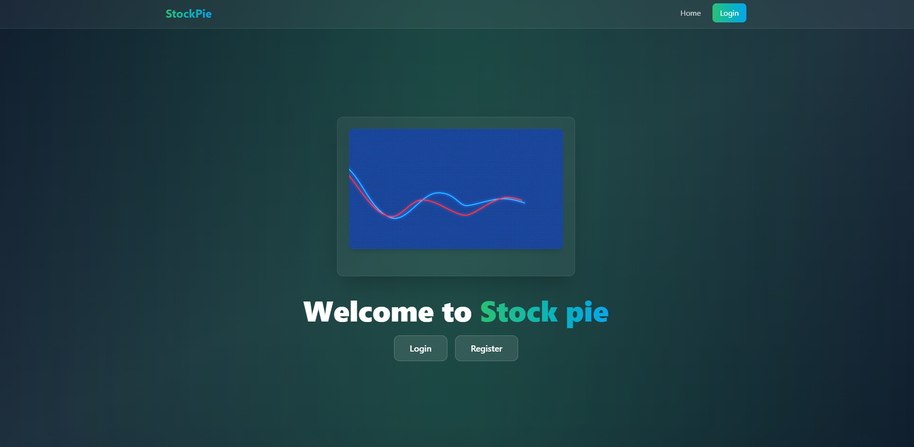
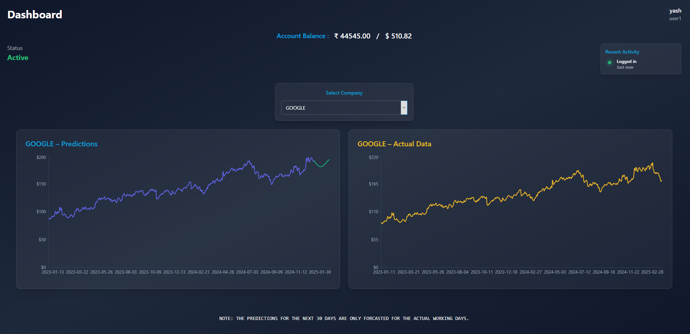

# 📊 StockPie


-green.svg)


StockPie is an AI-powered full-stack application that delivers real-time stock insights and portfolio analytics. Built with a **React** frontend, **FastAPI** backend, and **MongoDB** for data storage, it utilizes an **LSTM-based** deep learning model for intelligent and accurate stock price predictions.

---






## 📋 Table of Contents

1. 🚀[Quick Start](#-quick-start)
2. ✨[Highlights](#-highlights)
3. ⚙️[Prerequisites](#️-prerequisites)
4. 📥[Installation & Setup](#-installation--setup)
5. 🧭[Project Structure](#-project-structure)
7. 📦[Dependencies (`requirements.txt` / `package.json`)](#-dependencies-requirementstxt--packagejson)
8. ⚒️[Customization Tips & Extensions](#%EF%B8%8F-customization-tips--extensions)
9. 🐛[Troubleshooting](#-troubleshooting)
10. 📫[Contact](#-contact)

---

## 🚀 Quick Start

```bash
git clone https://github.com/04yashgautam/stockpie.git

# Backend setup
cd stockpie/backend
python -m venv venv
source venv/bin/activate     # On Windows: venv\Scripts\activate
pip install -r requirements.txt
uvicorn main:app --reload

# Frontend setup
cd ../frontend
npm install
npm start
```

Frontend will run at **[http://localhost:5173]**, with backend APIs on **[http://localhost:8000]**.

---

## ✨ Highlights

* **Live stock portfolio tracking**: monitor tickers in your dashboard
* **RESTful API** powered by FastAPI and MongoDB (via Motor/ODMantic)
* **Modern React UI** for charts, portfolio management, and user-friendly interaction
* **Real-time updates** using polling or websockets (configurable)
* **Stateless architecture**: scalable and easy to deploy

---

## ⚙️ Prerequisites

Ensure you have:

* Python 3.8+
* Node.js 14+ & npm or yarn
* MongoDB (local instance or Atlas cluster)
* Git

---

## 📥 Installation & Setup

1. **Clone the repo:**

   ```bash
   git clone https://github.com/04yashgautam/stockpie.git
   ```

2. **Backend Setup:**

   ```bash
   cd stockpie/backend
   python -m venv venv
   source venv/bin/activate
   pip install -r requirements.txt
   export MONGO_URL="mongodb://localhost:27017"
   uvicorn main:app --reload
   ```

3. **Frontend Setup:**

   ```bash
   cd ../frontend
   npm install
   npm start
   ```

   Visit **[http://localhost:5173]** to use the app.

---

## 🧭 Project Structure

* **backend/** – FastAPI application, endpoints, data models, and MongoDB connectivity
* **frontend/** – React project for UI components, pages, and routing
* **shared/** (optional) – DTOs or model definitions shared across backend/frontend

---

### React frontend features:

* Add/remove tracked stocks
* Dashboard view with charts and analytics
* Historical performance plots
* User authentication (if implemented)

---

## 📦 Dependencies (`requirements.txt` / `package.json`)

**backend/requirements.txt:**

```
fastapi>=0.70.0
uvicorn[standard]>=0.15.0
motor>=3.1.0         # or ODMantic if used
pydantic>=1.9.0
python-dotenv
```

**frontend/package.json (partial):**

```json
{
  "dependencies": {
    "react": "^17.0.0",
    "axios": "^0.24.0",
    "recharts": "^2.1.0",
    "react-router-dom": "^6.x",
    "tailwindcss": "^3.0.0"
  }
}
```

---

## ⚒️ Customization Tips & Extensions

* Swap charts library (e.g. D3.js, Chart.js, Victory)
* Add authentication via JWT / OAuth
* Use WebSocket SDK for live price updates
* Add portfolio analytics (e.g. P/E ratios, indicators)
* Deploy backend and frontend using Vercel & Render

---

## 🐛 Troubleshooting

* **Backend errors connecting to MongoDB** → confirm `MONGO_URL` is set correctly
* **CORS issues** → configure `fastapi.middleware.cors.CORSMiddleware`
* **Frontend build issues** → ensure Node/npm versions match the `package.json`
* **Port conflicts** → default ports: backend `8000`, frontend `3000`; adjust if needed

---

## 📫 Contact

Developed by **Yash Gautam** [reach out on GitHub (Mine)](https://github.com/04yashgautam) & **Harsh Jha** [reach out on GitHub (His)](https://github.com/Indvein) 

— feel free to for bugs or suggestions.

⭐️ If you find this useful, give it a star!

---
